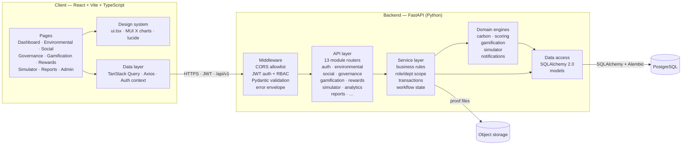
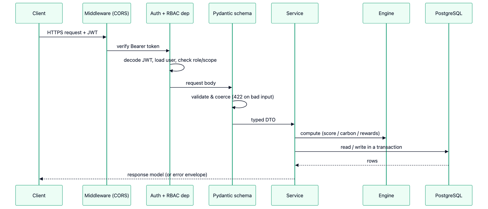
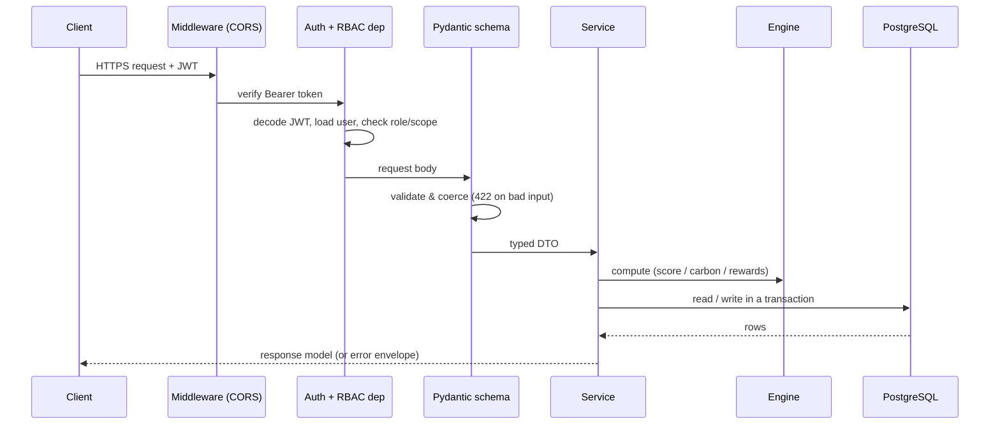
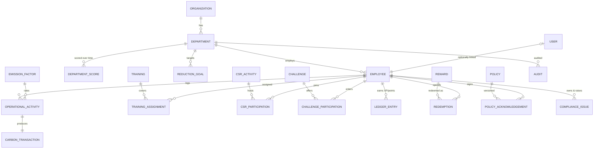
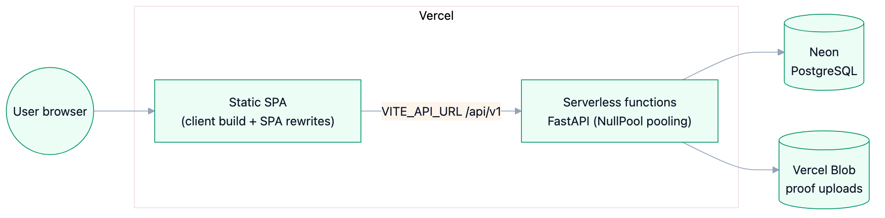
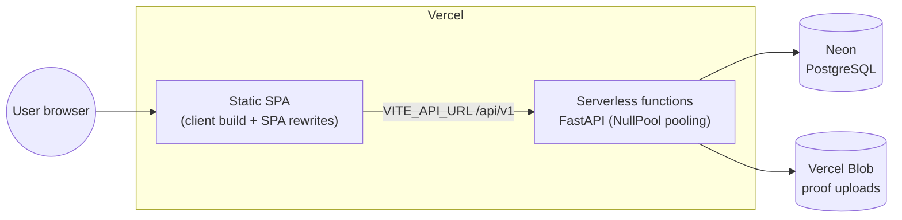

# EcoSphere — Architecture

EcoSphere is an ESG (Environmental, Social, Governance) management platform. It
pairs a **measurement & compliance** core (carbon accounting, policies, audits,
scoring) with a **participation** core (challenges, CSR, training, rewards), and
adds a **What‑If Simulator** as a differentiator.

The system is a typed **React SPA** talking to a **layered FastAPI backend**
over a versioned REST API, backed by **PostgreSQL**. Every layer has one job,
which keeps the code modular, testable and easy to reason about.

---

## 1. Application architecture

A strict top‑down flow: the browser only speaks to routers; routers only speak
to services; services own the business rules and delegate calculations to
domain **engines**; engines and services persist through the **ORM**. Nothing
skips a layer.

**Why this shape**

- **Routers** are thin: parse/validate input, resolve the caller + role scope,
  call one service, return a response model. No business logic lives here.
- **Services** hold the rules — workflow transitions, permission scoping
  (e.g. a department head only sees their department), and atomic transactions
  such as reward redemption (balance check + ledger write + stock decrement).
- **Engines** are side‑effect‑light calculators — carbon conversion, 0–100 ESG
  scoring, XP/points + badge rules, and the simulator's recommendation ranking.
  They are the reusable "brain" shared across modules.
- **ORM models** are the single source of truth for the schema; migrations are
  generated with Alembic so the database is versioned, not hand‑patched.

---

## 2. Request lifecycle

Every authenticated request passes the same gauntlet, so validation, security
and error handling are consistent across all 13 modules.

Domain failures raise a typed `AppError`; a single exception handler renders
them as a uniform JSON envelope `{ error: { code, message, details } }` with the
right HTTP status — the frontend handles one error shape everywhere.

---

## 3. Data model (grouped by pillar)

The relational schema is normalised around a shared organisation → department →
employee spine, with each ESG pillar owning its own tables and a dedicated
snapshot table for score trends.

Highlights judges tend to look for:

- **Referential integrity** everywhere via foreign keys; `Department.head` uses a
  deferred constraint to resolve the department↔employee cycle cleanly.
- **Enumerated types** for roles, statuses and activity kinds instead of loose
  strings.
- **Auditability** — issues track both a `created_by` (who raised it) and an
  `owner` (who works it); ledger rows are append‑only.
- **Trends without recomputation** — live scores are computed on demand, while
  `DepartmentScore` stores dated snapshots for historical charts.

---

## 4. Deployment topology

Runs entirely on managed, free‑tier services; the same code runs locally against
a local Postgres and disk‑backed uploads.

The backend detects the serverless environment and switches SQLAlchemy to
`NullPool` (no long‑lived connections), reads its DB/CORS/Blob config from
environment variables, and stores proof files in Blob in production while
falling back to local disk in development.

---

## 5. Design principles & engineering standards

| Area | Standard applied |
| --- | --- |
| **Structure** | Layered, modular architecture (router → service → engine → ORM); one module per bounded context. |
| **Database** | Normalised relational schema, FK integrity, enum types, Alembic migrations, snapshot tables for trends. |
| **Validation** | Pydantic schemas at every boundary; invalid input fails fast with `422` and field‑level detail. |
| **Errors** | Custom `AppError` hierarchy rendered through one handler into a consistent JSON envelope. |
| **Security** | JWT access/refresh tokens, bcrypt password hashing, role‑ and department‑scoped RBAC dependencies, CORS allowlist, upload type/size checks. |
| **Data integrity** | Atomic transactions for money‑like flows (reward redemption, XP/points ledger); append‑only ledgers. |
| **Frontend** | TypeScript throughout, typed Axios client, TanStack Query caching, role‑aware routing, a single design system + MUI X charts. |
| **Code quality** | PEP 8, type hints and short, intent‑revealing docstrings on the backend; `tsc` + ESLint on the frontend. |
| **Config & deploy** | 12‑factor env‑driven config, serverless‑safe DB pooling, reproducible local ↔ production parity. |

These choices map directly to the judging priorities: **relational database
design first**, backend APIs written from scratch, real/dynamic data, robust
validation with graceful errors, and modular, secure, consistent code.
