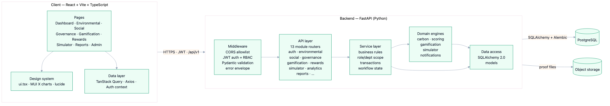
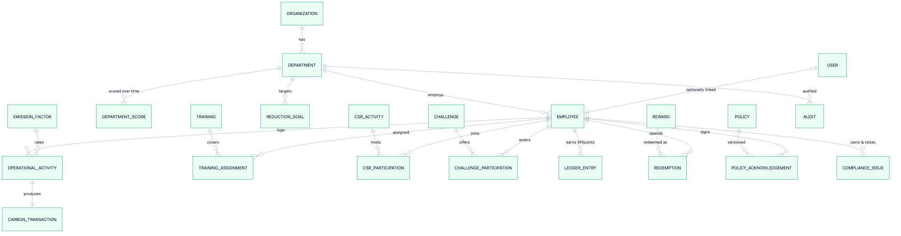

# EcoSphere — ESG Management Platform

EcoSphere helps a company **measure** its ESG (Environmental, Social, Governance)
performance and **improve it** by getting employees genuinely involved through
gamification. It turns scattered sustainability data into a single, live
scorecard — and a set of actions people actually want to complete.

Built for the Odoo hackathon by a team of three.

---

## Live demo

| | URL |
| --- | --- |
| **Web app** | https://ecosphere-client.vercel.app |
| API | https://ecosphere-server.vercel.app |
| API health | https://ecosphere-server.vercel.app/health |

> Log in with any account from [Test credentials](#test-credentials) — password is the same for all.

---

## Table of contents

- [What it does](#what-it-does)
- [Our approach](#our-approach)
- [Architecture](#architecture)
- [Database design](#database-design)
- [Tech stack](#tech-stack)
- [Test credentials](#test-credentials)
- [How to test the app](#how-to-test-the-app)
- [Run locally](#run-locally)
- [Deployment](#deployment)
- [Project structure](#project-structure)

---

## What it does

**Two engines, one platform:**

1. **Measurement & compliance** — carbon accounting, ESG scoring, policies, audits, compliance issues.
2. **Participation** — challenges, CSR drives, training, badges, a leaderboard and a rewards store.

**Feature highlights**

- **Live ESG scoring** — Environmental / Social / Governance scored 0–100 per department and rolled up to an org score. Nothing is hard-coded; everything is computed from the database.
- **Environmental** — log operational activity; the emission factor drives the unit and the carbon math automatically.
- **Social** — CSR sign-ups with live capacity, plus manager-assigned training courses.
- **Governance** — policies with acknowledgement tracking, audits, and compliance issues that record both who *raised* and who *owns* them.
- **Gamification** — XP/points, auto-awarded badges, a leaderboard, and a manager approval queue (submissions need proof).
- **Rewards** — spend points in a store; balances update instantly and redemption is an atomic transaction.
- **What-If Simulator** *(our differentiator)* — adjust a department's levers and see the projected ESG score plus a ranked list of highest-impact actions, computed entirely on our own data.
- **Reports** — four ready-made reports plus a custom builder, exportable as PDF / Excel / CSV.
- **Role-based access** — Admin, Department Head and Employee each see exactly what they should, enforced on the server.

---

## Our approach

We prioritised what the judges asked for, in order:

- **Relational database first.** A normalised PostgreSQL schema with real foreign-key integrity is the backbone — see [Database design](#database-design).
- **Backend APIs written from scratch.** A FastAPI backend with a strict, layered flow: `router → service → domain engine → ORM`. Each layer has one job, so the code stays modular and testable.
- **Real, dynamic data.** Scores, leaderboards, emissions and reports are all computed live from the database — no static JSON in the product.
- **Robust validation & graceful errors.** Every request is validated with Pydantic, and all domain errors come back in one consistent JSON envelope instead of stack traces.
- **Security.** JWT auth with bcrypt-hashed passwords and role-based access control enforced server-side. Money-like flows (reward redemption) run in atomic transactions so points can't be double-spent.
- **Clean, consistent UI.** One design system, role-aware navigation, and rich charts (MUI X) instead of raw tables.

Full write-up with diagrams: **[ARCHITECTURE.md](ARCHITECTURE.md)**.

---

## Architecture

Strict layering — the browser only talks to routers; routers call services;
services own the rules and delegate calculations to domain engines; engines and
services persist through the ORM.



---

## Database design

Normalised around an **organisation → department → employee** spine, with each
ESG pillar owning its own tables and a dated snapshot table for score trends.



**Design highlights**

- **Referential integrity** everywhere via foreign keys; the department ↔ employee cycle is resolved with a deferred constraint.
- **Enumerated types** for roles, statuses and activity kinds — no loose strings.
- **Auditability** — compliance issues track both a creator and an owner; the XP/points ledger is append-only.
- **Trends without recomputation** — scores are computed live, while `department_score` stores dated snapshots for history.
- **Versioned schema** — all tables are created and evolved through Alembic migrations.

---

## Tech stack

| Layer | Technology |
| --- | --- |
| Frontend | React, Vite, TypeScript, Tailwind CSS, TanStack Query, MUI X Charts |
| Backend | FastAPI, Pydantic, SQLAlchemy 2.0, Alembic |
| Database | PostgreSQL (Neon in production) |
| Auth | JWT (access + refresh), bcrypt, role-based access control |
| Reports | ReportLab (PDF), openpyxl (Excel), CSV |
| Hosting | Vercel (frontend + serverless backend), Neon Postgres, Vercel Blob |

---

## Test credentials

**Password for every account:** `Password123`

| Role | Email | Can do |
| --- | --- | --- |
| **Admin** (non-participating) | `admin@ecosphere.com` | Full CRUD, org settings, all reports, org-wide visibility |
| **Department Head** (Manufacturing) | `arjun@ecosphere.com` | Approvals, assign courses, manage department issues & audits |
| **Employee** (Sustainability Lead) | `priya@ecosphere.com` | Log activity, join challenges/CSR, redeem rewards |

<details>
<summary>More accounts (same password)</summary>

| Role | Email | Department |
| --- | --- | --- |
| Department Head | `neha@ecosphere.com` | Logistics |
| Department Head | `rohan@ecosphere.com` | Operations |
| Department Head | `dev@ecosphere.com` | People & Culture |
| Employee | `sara@ecosphere.com` | Manufacturing |
| Employee | `vikram@ecosphere.com` | Manufacturing |
| Employee | `ananya@ecosphere.com` | Logistics |
| Employee | `karan@ecosphere.com` | Logistics |
| Employee | `meera@ecosphere.com` | Operations |

</details>

---

## How to test the app

Open the **web app** link and try this 5-minute path:

**As an Employee** (`priya@ecosphere.com`)
1. **Dashboard** — see the four-way ESG split, department radar and emissions trend.
2. **Environmental** — log an activity; the emission factor auto-drives the unit and carbon math.
3. **Gamification** — join a challenge. **Rewards** — redeem points and watch the balance update instantly.
4. **What-If Simulator** — pick a department, move the levers, see the projected score and ranked recommendations.

**As a Department Head** (`arjun@ecosphere.com`)
5. **Approvals** — review a submission (with proof) and approve it.
6. **Governance** — note issues show who raised vs who owns them; visibility is department-scoped.

**As an Admin** (`admin@ecosphere.com`)
7. **Admin** — full CRUD and org settings.
8. **Reports** — generate a PDF/Excel/CSV via the custom builder (module + department + date range).

> Role-based access is enforced on the server — each role only sees what it should.

---

## Run locally

**Prerequisites:** Python 3.11+, Node 18+, a local PostgreSQL database.

### Backend

```bash
cd server
python -m venv .venv && source .venv/bin/activate
pip install -r requirements.txt

cp .env.example .env            # set DATABASE_URL and JWT_SECRET
alembic upgrade head            # create the schema
python seed.py                  # load demo data

uvicorn app.main:app --reload --port 8000
```

API runs at `http://localhost:8000` (docs at `/docs`).

### Frontend

```bash
cd client
npm install
npm run dev
```

App runs at `http://localhost:5173`. Leave `VITE_API_URL` unset locally — it
defaults to the local API.

---

## Deployment

The app runs fully on free tiers: Vercel (frontend + serverless FastAPI) +
Neon (PostgreSQL) + Vercel Blob (uploads). Step-by-step guide:
**[DEPLOYMENT.md](DEPLOYMENT.md)**.

---

## Project structure

```
ecosphere-esg-platform/
├── client/            # React + Vite + TypeScript frontend
│   └── src/
│       ├── pages/         # one page per module
│       ├── components/    # design system, charts, icons
│       └── lib/           # API client, auth, hooks
├── server/            # FastAPI backend
│   ├── app/
│   │   ├── api.py         # aggregates all module routers
│   │   ├── core/          # config, database, security, exceptions
│   │   ├── deps/          # auth + RBAC dependencies
│   │   ├── engines/       # carbon, scoring, gamification, simulator
│   │   ├── models/        # SQLAlchemy ORM models
│   │   └── modules/       # router + service + schemas per feature
│   ├── alembic/           # database migrations
│   └── seed.py            # demo data
├── docs/              # architecture diagrams
├── ARCHITECTURE.md
└── DEPLOYMENT.md
```
